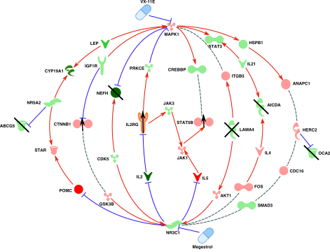
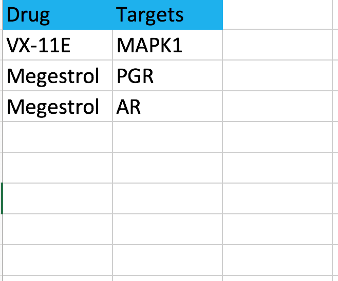
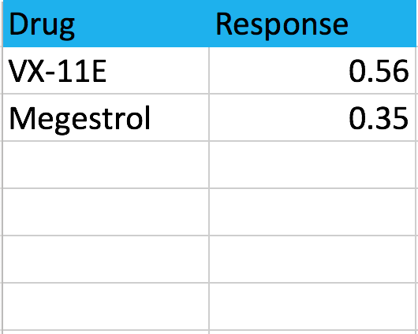
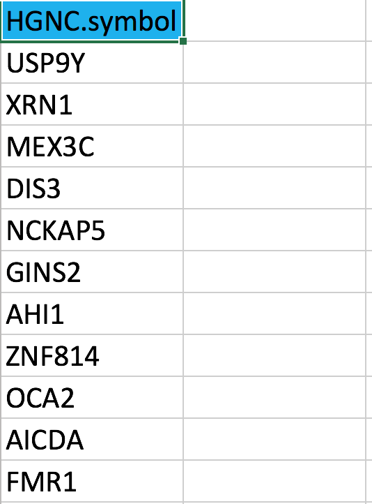
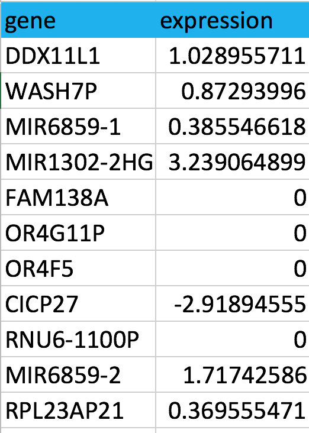

# PatientNet: a shiny web application for visualizing patient-specific cancer vulnerability networks. 
 

## Introduction
PatientNet is part of drug combination prediction and testing (DCPT) platform developed by computational systems medicine group at FIMM, University of Helsinki (<https://www.fimm.fi/en/research/groups/aittokallio>). PatientNet constructs and visualizes patient-specific cancer vulnerability networks based on the patient-specific combination predictions. For each patient, the pathway cross-talk network is constructed by establishing the shortest paths that connect the selective drug targets of the predicted combinations to the patient-specific genetic aberrations and molecular changes, including mutated or dysregulated genes, through a comprehensive cancer signaling network from two large-scale studies[1,2]. Users can also use PatientNet service at <https://patientnet.fimm.fi>. 

## Usage
Input type: one single xlsx file with four sheets (Targets, DSS, Mutation, and Gene.exp) or four separate files containing the same data as one single xlsx file. Example data can be found: <https://github.com/hly89/PatientNet/tree/master/data>. 

Targets file: each row has both the drug name and its target. One row only shows one target. For multi-targeting drugs, you need to have one row for each target.

DSS file: each row has both the drug name and its response (drug sensitivity score).

Mutation file: a list of mutations (HGNC symbol).

Mutation file: each row has both the gene name (HGNC symbol) and normalized expression vaule.

## Support
If you have any problems in using PatientNet, please contace **Liye He** (liye.he@helsinki.fi)

## Copyright & License

Code released under the MIT license.

## References

1. Zaman N, Li L, Jaramillo Maria L, Sun Z, Tibiche C, Banville M, et al. Signaling Network Assessment of Mutations and Copy Number Variations Predict Breast Cancer Subtype-Specific Drug Targets. Cell Reports 2013;5:216-23.
2. Kirouac DC, Saez-Rodriguez J, Swantek J, Burke JM, Lauffenburger DA, Sorger PK. Creating and analyzing pathway and protein interaction compendia for modelling signal transduction networks. BMC Syst Biol 2012;6:29.
